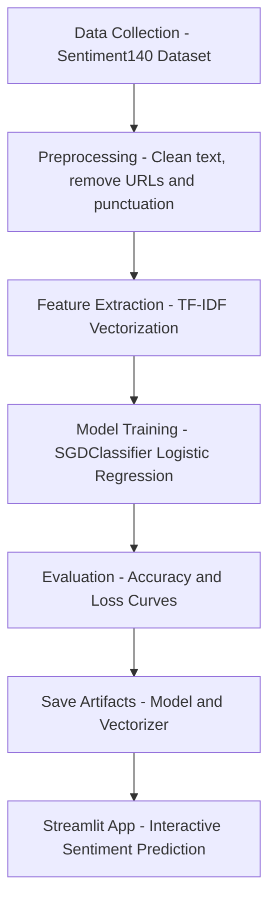
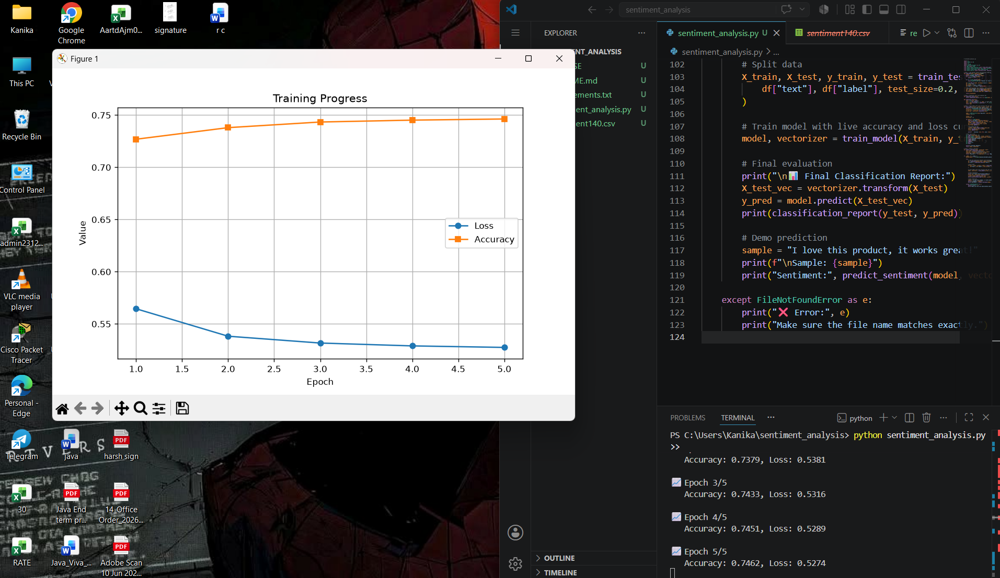
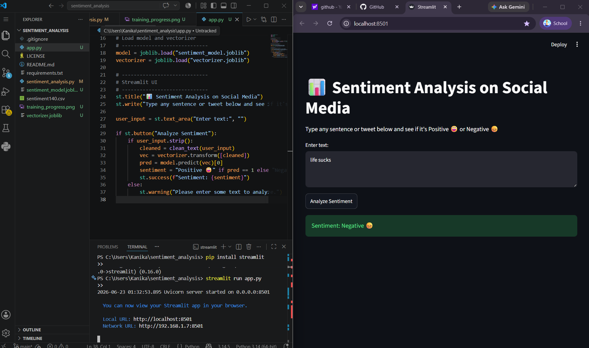

# 📊 Sentiment Analysis on Social Media

A machine learning project that classifies social media text (tweets/reviews) into **Positive 😀** or **Negative 😞** sentiment using NLP techniques.

---

## 🔄 Project Workflow



---

## 📁 Project Structure
---

## 🚀 Getting Started

### 1. Clone the repository
```bash
git clone https://github.com/kanika29082008-collab/sentiment_analysis.git
cd sentiment_analysis
```

### 2. Install dependencies
```bash
pip install -r requirements.txt
```

### 3. Download the dataset
Download `sentiment140.csv` from [Kaggle - Sentiment140](https://www.kaggle.com/datasets/kazanova/sentiment140) and place it in the project root.

### 4. Train the model
```bash
python sentiment_analysis.py
```
This will generate `sentiment_model.joblib` and `vectorizer.joblib`.

### 5. Run the Streamlit app
```bash
streamlit run app.py
```

---

## 🧠 How It Works

| Step | Description |
|------|-------------|
| **Data Collection** | Uses the Sentiment140 dataset with 1.6 million tweets |
| **Preprocessing** | Removes URLs, mentions, punctuation, and stopwords |
| **Feature Extraction** | Converts text to numerical features using TF-IDF Vectorization |
| **Model Training** | Trains an SGDClassifier (Logistic Regression) on the processed data |
| **Evaluation** | Measures accuracy and plots loss curves |
| **Deployment** | Interactive prediction via a Streamlit web app |

---

## 📦 Dependencies
Install all with:
```bash
pip install -r requirements.txt
```

---

## 📈 Model Performance

- **Dataset:** Sentiment140 (1.6M tweets)
- **Algorithm:** SGDClassifier with log loss (Logistic Regression)
- **Vectorizer:** TF-IDF
- **Task:** Binary classification — Positive vs Negative sentiment

---

## ⚠️ Notes

- The dataset (`sentiment140.csv`) and model files (`*.joblib`) are excluded from this repository due to size limits.
- Download the dataset from Kaggle before training.
- Model files are generated locally after running `sentiment_analysis.py`.

---

## 📄 License

This project is licensed under the MIT License. See the [LICENSE](LICENSE) file for details.

---

## 🙋‍♀️ Author

**Kanika** — [@kanika29082008-collab](https://github.com/kanika29082008-collab)
---

## 📸 Screenshots

### 🏋️ Training Progress


> Model trained over 5 epochs — Accuracy reached **74.62%** with Loss dropping to **0.5274**

### 🌐 Streamlit App Interface


> Live demo: Enter any text and instantly get **Positive 😀** or **Negative 😞** sentiment prediction